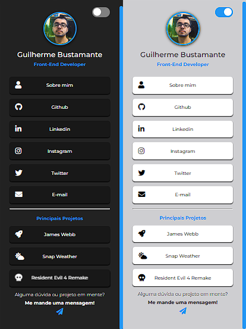

# Link Hub :link:

  

## Descrição :page_with_curl:
O Link Hub é um projeto de página de links que **reune todos os meus links de redes sociais e de alguns projetos em um só lugar.**
  
Sendo criado para fins de estudo e uso profissional, este projeto tem como objetivo praticar programação e reunir todas as minhas redes sociais na mesma página, dessa forma facilitando que os usuarios entrem em contato comigo e/ou visualizem os meus projetos.

***

## Como acessar o site? :computer:
- Para acessar o site online **[clique aqui](https://gui-bus.github.io/link-hub/)**.

***

## Tecnologias utilizadas :dart:

 
  
  
  

***

## Contribuição :bulb:
Gostaria de contribuir para o projeto? Fico muito grato pelo interesse!
- Sinta-se à vontade para entrar em contato comigo através das minhas redes sociais para enviar suas mensagens, sugestões ou comentários sobre o projeto.

***

## Fontes e agracimentos :handshake:
- **[Breno Cupertino](https://github.com/brenocuper)** por fornecer o conhecimento necessário para a criação do site. 
- **[OneBitCode](https://onebitcode.com/lp/)** por fornecer o conhecimento necessário, por meio do curso FullStack, para a criação do site.

***

## Redes sociais para contato! :speech_balloon:

